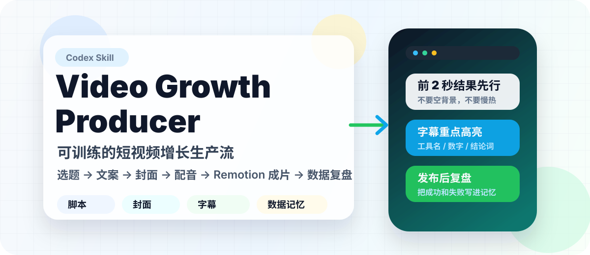

<p align="center">
  
</p>

<p align="center">
  <a href="LICENSE"></a>
  
  
  
  
</p>

# Video Growth Producer

`video-growth-producer` 是一个可训练的短视频生产 Skill。

它不是只写文案的提示词，而是一套尽量标准化的生产线：选题、文案、分镜、imagegen 素材、封面、字幕、配音、Remotion 成片、发布前校验和数据复盘。

## 重要说明：发布级视频必须有图片大模型

默认模式是 `strict` 发布模式。

发布级视频必须能调用 `imagegen` 或等价图片生成能力。原因很简单：这个 Skill 的高质量效果依赖实时生成主视觉、场景图、封面底图和关键解释画面。

如果当前 Agent 没有图片大模型：

- 不允许生成“发布级视频”。
- 不允许假装已经使用 imagegen。
- 不允许把低质量视频当成完整版本交付。
- 可以在用户明确同意后，切换到 `remotion-only` 预览模式。

`remotion-only` 只能做预览：它可以使用 Remotion UI、文字卡片、官方 Logo、截图和基础动效，但不能达到完整发布模式的画面质量。

## 能做什么

你可以让 Codex 使用这个 Skill：

```text
使用 video-growth-producer，帮我生成一期视频。
```

也可以直接给文案：

```text
使用 video-growth-producer，把下面这段文案做成短视频：

<粘贴你的文案>
```

Skill 会按流程输出：

- 爆款方向的短视频文案
- `visual_plan.json`
- imagegen 素材规划和素材清单
- 字幕时间轴
- 重点词黄色高亮
- AI 旁白或用户提供的人声
- Remotion 竖屏视频
- 3:4 封面图
- 发布前质量校验结果
- 发布后的数据复盘记录

## 安装

Windows PowerShell：

```powershell
git clone https://github.com/dudachun/video-growth-producer.git $env:USERPROFILE\.codex\skills\video-growth-producer
```

macOS / Linux：

```bash
git clone https://github.com/dudachun/video-growth-producer.git ~/.codex/skills/video-growth-producer
```

安装后重新打开一个 Codex 会话。

## 第一次使用

初始化本地创作者资料：

```bash
python scripts/init_creator_profile.py --profile default
```

检查工作区：

```bash
python scripts/check_workspace.py --profile default
```

检查严格发布模式是否可用：

```bash
python scripts/doctor.py --mode strict --imagegen available
```

注意：只有当前 Agent 确实可以调用 imagegen 时，才可以传 `--imagegen available`。如果不能调用图片大模型，严格模式应该停止。

## 两种模式

### strict 发布模式

默认模式，目标是生成可发布的视频。

要求：

- 必须有 imagegen 或等价图片生成能力。
- 必须生成 `visual_plan.json`。
- 必须生成 `episode_manifest.json`。
- 必须生成封面。
- 必须有字幕。
- 字幕位置固定在屏幕从上往下约 75%。
- 字幕白色、黑色阴影、不描边。
- 重点词、数字、工具名、结论词用黄色。
- 前 2 秒必须有主体画面。
- 前 5 秒必须能看懂问题和价值。
- 每 3-5 秒切换一次主画面结构。
- 每 0.8-1.5 秒有一个微动效或视觉变化。
- 发布前必须通过校验脚本。

### remotion-only 预览模式

只有用户明确同意时才使用。

适合：

- 当前 Agent 没有图片大模型。
- 只想先看文案、字幕和基础节奏。
- 后续再补 imagegen 素材。

限制：

- 不能称为发布级视频。
- 不能假装使用了 imagegen。
- 输出文件名建议带 `_preview` 或 `_remotion_only`。

## 推荐生产流程

1. 读取创作者资料和内容记忆。
2. 判断模式，默认 `strict`。
3. 跑 `doctor.py`。
4. 生成或整理文案。
5. 生成 `visual_plan.json`。
6. 严格模式下生成 imagegen 素材，并复制进项目素材目录。
7. 生成或导入旁白。
8. 单独质检开头前 5 秒旁白。
9. 生成字幕时间轴。
10. 生成 `episode_manifest.json`。
11. 用 Remotion 模板渲染视频。
12. 生成 3:4 封面。
13. 跑 `validate_episode.py`。
14. 通过后再交付。

## 关键脚本

```text
scripts/init_creator_profile.py
scripts/check_workspace.py
scripts/doctor.py
scripts/create_caption_timeline.py
scripts/create_cover.py
scripts/export_manifest_to_remotion.py
scripts/validate_visual_plan.py
scripts/validate_video.py
scripts/validate_episode.py
scripts/update_content_memory.py
scripts/update_performance_ledger.py
```

## Remotion 模板

模板位置：

```text
assets/remotion-template/
```

核心文件：

```text
assets/remotion-template/src/episode_manifest.ts
assets/remotion-template/src/VideoGrowthTemplate.tsx
assets/remotion-template/src/Root.tsx
```

模板已经内置：

- 1080x1920
- 30fps
- 字幕 75% 位置
- 黄色重点词
- 首屏主体内容布局
- strict / remotion-only 模式标识
- 基础动态卡片、对比、流程、检查清单布局

运行示例：

```bash
cd assets/remotion-template
npm install
npm run lint
npm run still
npm run render
```

## 发布前校验

严格模式必须跑：

```bash
python scripts/validate_visual_plan.py visual_plan.json --mode strict
python scripts/validate_episode.py episode_manifest.json --mode strict
```

如果校验失败，不要交付成片。先修 `visual_plan`、素材、字幕、封面、音频或输出规格。

## 训练自己的内容方向

你可以随时告诉 Codex：

```text
以后我的账号方向是给企业老板讲 AI 落地，最终目标是咨询和课程转化。
```

或者：

```text
以后开头不要先讲概念，要先给冲突、结果或者真实场景。
```

这些内容应该写入本地：

```text
profiles/default/content-memory.md
profiles/default/winning-patterns.md
profiles/default/forbidden-patterns.md
profiles/default/visual-style.md
```

公共仓库不会保存你的私人账号数据。

## 不要提交的内容

公开仓库不应该包含：

- 私人声音样本
- 声纹文件
- 克隆声音输出
- 已生成视频
- 私人账号截图
- 发布数据截图
- 本地绝对路径配置
- 个人 BGM 文件

`.gitignore` 已经默认排除常见生成文件和私人文件。

## 开源协议

MIT License
